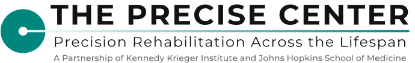
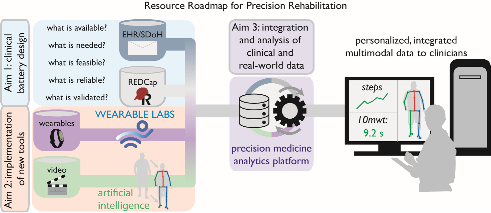

  

<h1 align="center">Welcome to the Precise Center Resource Core</h1>

## Our Mission

We bridge the gap between cutting-edge research tools and practical clinical implementation in rehabilitation. Our goal is to provide resources that integrate clinician-centered AI, remote monitoring tools, and clinical data for comprehensive functional outcomes within and outside of the clinic during rehabilitation. We are committed to **open science and accessibility** – our technologies are designed to be accessible to clinicians and researchers with minimal technical expertise. 

  

## 🔬 What We Provide

We help precision rehabilitation teams to:

- **Design and implement** standardized batteries of clinical data collection
- **Develop and implement** new measurement tools that complement clinical data  
- **Integrate** multimodal data for easy viewing, analysis, and interpretation

## 📚 Types of Resources Available

  
Click to expand

### 🔧 Tools & Software
- **AI-based motor assessment** using computer vision – analyze patient movement from simple smartphone videos
- **Wearable device data collection** – streamlined management of data from consumer-grade devices like Fitbit
- **Analysis code** for movement kinematics and clinical outcomes
- **Data integration platforms** for viewing multimodal data in one place

### 📋 Clinical Materials
- Standardized clinical assessment batteries
- Questionnaires and outcome measures
- Data collection protocols

### 📖 Guidance & Documentation
- Step-by-step implementation guides
- Video tutorials with transcripts
- Information sheets and schematics
- Stakeholder engagement strategies

## 👥 Who Is This For?

  
Click to expand

  
### Rehabilitation Researchers
Clinical and translational researchers who need:
- Validated tools for movement assessment
- Scalable data collection systems
- Open-source analysis code

### Rehabilitation Clinicians
Physical therapists, occupational therapists, speech-language pathologists, physiatrists, and neurologists who want to:
- Track patient outcomes objectively over time
- Measure movement quality and quantity
- Document patient progress within and outside the clinic
  
### Informatics and Health Systems Teams
Teams implementing precision rehabilitation models and seeking:
- Blueprints for clinical data batteries
- Integration solutions for multimodal data
- Accessible technology tools

**No extensive coding experience required!** Resources are designed to be accessible with minimal technical expertise.

## 🚀 Using Resources

  
Click to expand

 
  
You can get started by:
1. **Browsing repositories** to find tools and resources relevant to your needs
2. **Watching video tutorials** with step-by-step instructions
3. **Downloading and adapting materials** resources to your specific clinical or research context
4. **Sharing feedback** through issues or discussions
   

## 🤝 Want to Contribute?

  
Click to expand

 
We welcome contributions from Precise Center members and collaborators! This includes members of the team, pilot program grantees, PACES scholars, and the broader rehabilitation community.  

Whether you have analysis code, clinical tools, protocols, or educational materials to share, we would love to include them in our resource library.

**Before sharing your resource, please contact our team and check out our [Contribution Guidelines](../CONTRIBUTING.md) to get started.**

All users and contributors are expected to follow our [Code of Conduct](../CODE_OF_CONDUCT.md).

## ✨ Our Commitment to Open Science

By sharing our resources openly, we aim to:

- 🌍 Make precision rehabilitation accessible to all
- 📊 Promote reproducible and transparent rehabilitation research
- 🤝 Build a collaborative community advancing precision rehabilitation
- 💡 Enable clinicians to provide better, data-informed care

---

## 📫 Contact & Learn More

  
Click to expand

   
Check out funding and training opportunities for early stage investigators on our website!

- **Website:** https://precise-rehab.org
- **Email:** PreciseCenter@kennedykrieger.org
- **Location:** Kennedy Krieger Institute and Johns Hopkins University School of Medicine

## 📜 How to Cite

If you use resources from this repository in your work, please cite:

* Resource Core of the Center for Precision Rehabilitation Across the Lifespan (NIH P50HD118624)

This work is supported by the [National Institutes of Health P50HD118624](https://reporter.nih.gov/search/4W3hBtC1IkStK9zikCtFYg/projects).

## 📄 License

Individual repositories may have specific licenses. Please check each repository for details. We encourage open-source licensing to maximize accessibility.

*Last updated: 2026-05-08-1441*
